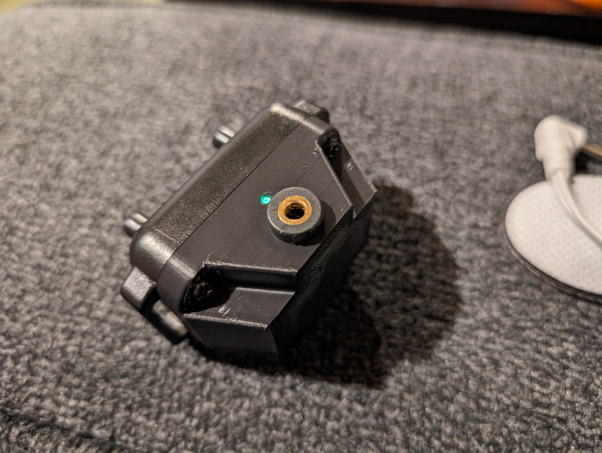
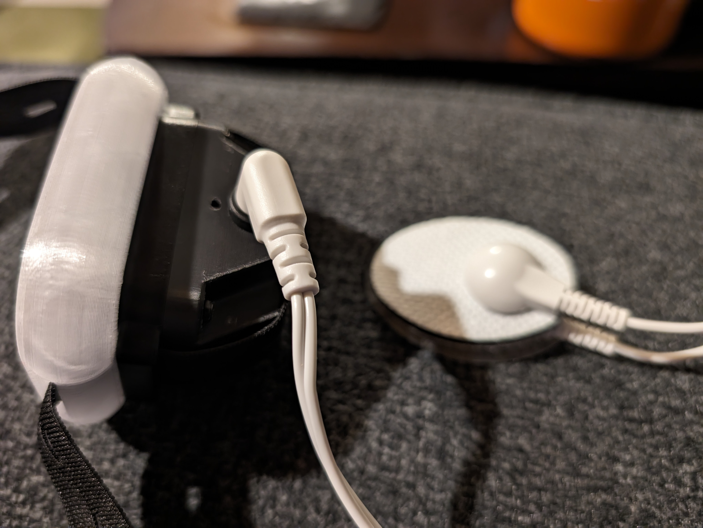

# StereoShock
 
## What
Stereoshock is a printed adapter for using TENS style pads with the shock collars used in the OpenShock project

## Why
The standard conductive rubber prongs on the collar are intended for use on pets, not humans. As a result, most of my testers limited the max power to 45%. With larger contact areas, you get a much wider and more controllable range of sensation, as well as being able to direct the shock into new areas where the collar wouldn't fit easily or comfortably

## How
The project consists of a 3-d printed housing for the front of the shock unit, a 3.5mm jack to insert leads, and a blanking plate to prevent the standard electrodes from making contact while wearing the collar. 

# IMPORTANT SAFETY INFO
This is provided without any warranty or guarentee of safety. Common sense applies. Do not use this device if you're sensitive to electrical impulses. Do not use with any insertable electrode. Only use pads below the waist, and never directly against the spine. The pads should never be more than an inch apart. This is not a medical device, and if you have ANY doubts about using this safely, please do not use. I am not liable for any misuse of this design or idea.

## Assembly
Instructions are in the [Assembly Guide](Docs/AssemblyInstructions.md)